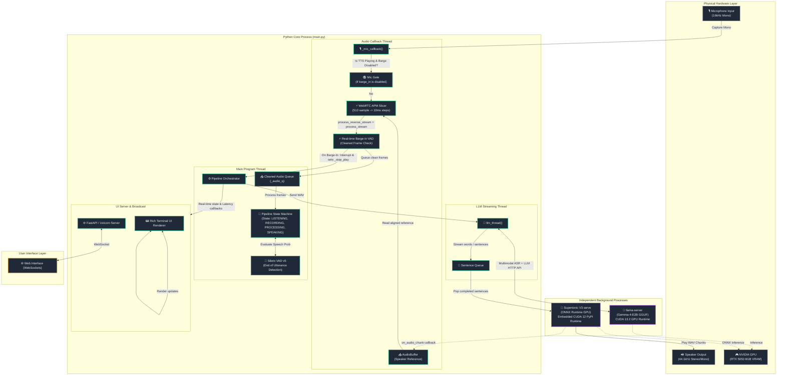

# Polyglot Live — System Architecture

This document describes the high-level architecture, thread boundaries, process model, and data flows of the Polyglot Live voice companion.

---

## System Topology & Data Flow

Polyglot Live uses a multi-process, multi-threaded pipeline designed to keep E2E latency under **600ms** on desktop GPUs while supporting real-time language switching, streaming synthesis, and WebRTC-based Acoustic Echo Cancellation (AEC).

---

## Key Architectural Modules

### 1. Multi-Threaded Audio Pipeline
To achieve full-duplex speech interaction without blocking the interface or dropping audio samples, the pipeline divides responsibilities across four distinct execution threads:
*   **Audio Callback Thread**: Runs in the context of the system's underlying audio capture server (`sounddevice` backend). It intercepts mic frames, performs WebRTC echo cancellation, runs the active barge-in check, and queues cleaned frames into `_audio_q`.
*   **Main Thread**: Loops on a tick execution cycle. It pulls frames from `_audio_q`, feeds them into Silero VAD to identify start/end of speech, and controls the state machine transition (`LISTENING` → `RECORDING` → `PROCESSING` → `SPEAKING`).
*   **LLM Streaming Thread**: When a user's speech completes, the Main Thread transitions to `PROCESSING` and fires off the LLM Query Thread. This thread consumes the token stream from `llama-server` asynchronously, splitting incoming text into individual sentences and loading them into a playout queue.
*   **TTS Output Callback / Playback**: Renders the speech chunks. If the audio callback thread flags an interruption, the TTS playout thread halts immediately (under 50ms latency).

---

### 2. WebRTC Acoustic Echo Cancellation (AEC)
Acoustic Echo Cancellation prevents the speaker output from leaking back into the microphone and triggering a self-interruption loop.
1.  **Reference Collection**: As the TTS engine plays audio blocks on the speakers, it passes them via a callback to the pipeline. The pipeline downmixes the audio to mono, resamples it from 44.1kHz to 16kHz using `torchaudio`, and appends it to a lock-protected reference `AudioBuffer`.
2.  **Chunk Boundary Matching**: WebRTC APM strictly requires **10ms frames** (160 samples at 16kHz). The system microphone records in **32ms blocks** (512 samples).
3.  **Real-Time Processing**: When a 512-sample frame is captured by the mic:
    *   We retrieve 512 samples of resampled speaker audio from the reference buffer (or zeros if nothing is playing).
    *   We slice both the mic stream and the reference stream into 160-sample slices.
    *   For each slice, we call `process_reverse_stream()` (feeding speaker audio) and `process_stream()` (feeding mic audio).
    *   We concatenate the processed slices into a cleaned output accumulator.
    *   When the accumulator reaches 512 samples, it is popped and forwarded to the VAD and barge-in validator.
4.  **Graceful Fallback**: If the compiled `aec-audio-processing` wrapper is missing, the system detects this at startup and falls back automatically to standard RMS/energy-based thresholding.

---

### 3. Latency Metrics (GPU Accelerated)

Running on an **NVIDIA RTX 5050 8GB Laptop GPU** with a mixed CUDA 12/13 runtime, the E2E latency budget is strictly tracked:

| Turn # | LLM TTFT | Total LLM Gen | TTS Latency | E2E Latency | Notes |
| :---: | :---: | :---: | :---: | :---: | :--- |
| **8** | 195ms | 984ms | 219ms | **867ms** | Multilingual synthesis |
| **7** | 329ms | 652ms | 167ms | **689ms** | Fast responses |
| **6** | 285ms | 1083ms | 165ms | **604ms** | Trilingual switch turn ⚡ |
| **5** | 113ms | 503ms | 167ms | **533ms** | Optimal network/GPU execution |
| **4** | 221ms | 750ms | 211ms | **794ms** | Native script Hindi response ⚡ |
| **3** | 267ms | 920ms | — | **1371ms** | Complex Hindi/English code-switch |
| **2** | 304ms | 756ms | — | **1167ms** | Fallback standard TTS playout |
| **1** | 268ms | 665ms | 153ms | **719ms** | Core English conversation turn |

*E2E latency represents the time between the user finishing speaking and the first byte of assistant speech rendering on the device.*
